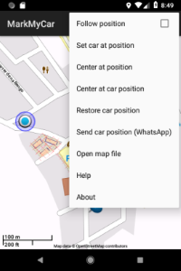
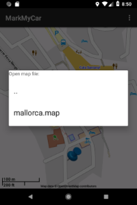
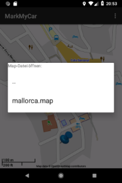
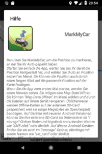

<h1>MarkMyCar</h1>
Deutsch weiter unten! 

 

 

This is an app to let you mark the position you parked your car at. It is based on offline maps provided by mapsforge.
You can download free maps of your location at http://download.mapsforge.org/maps/v4 
Copy any map files to your device and choose it from  the app's menu. Then you can use your device offline to mark the
position of your car. GPS location is supported. But you can just put a mark to any position you like. 
The mapsforge libraries (version 0.9.1) are provided by jar files within this repository. 
Now you can send the marked position via WhatsApp to any of your WhatsApp contacts (for a shared car or just
as a location). It is sent as a link, so the recipient can use Google's Map or MarkMyCar to show this position. 
You can build the app with AndroidStudio or find the APK in the app folder. 
 
 
<h1>MarkMyCar</h1>

 

 

Diese App lässt Sie die Position, an der Sie Ihr Auto geparkt haben, markieren. Sie basiert auf Offline-Karten von
Mapsforge. Sie können kostenlose Karten von http://download.mapsforge.org/maps/v4 herunterladen. 
Kopieren Sie Kartendateien Ihrer Gegend auf Ihr Android-Gerät und wählen Sie die gewünschte Karte aus dem
Menü der App. Sie können dann Ihr Android-Gerät offline benutzen, um die Position Ihres geparkten Autos zu markieren.
GPS-Positionserkennung wird unterstützt, Sie können aber auch eine beliebige Position auf der Karte markieren. 
Die Mapsforge-Bibliotheken (Version 0.9.1) sind als jar-Dateien dem Projekt-Repository hinzugefügt. 
Sie können jetzt die markierte Position auch per WhatsApp an irgend einen Ihrer WhatsApp-Kontakte senden (z. B. für
ein gemeinsam genutztes Auto oder nur als Position). Sie wird als Link versendet, so dass der Empfänger Google's Map
oder auch MarkMyCar verwenden kann, um die Position anzuzeigen. 
Sie können die App mit AndroidStudio übersetzen, oder aber die APK im app-Ordner finden. 
